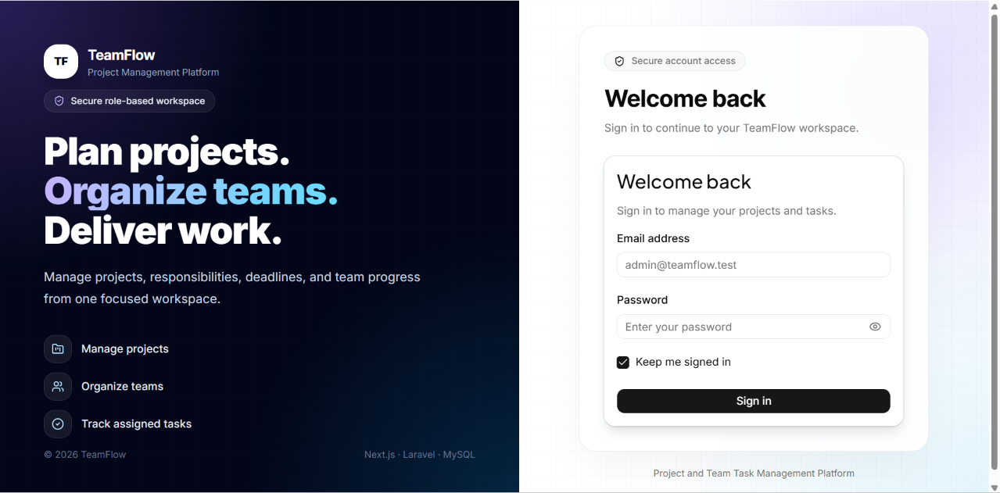
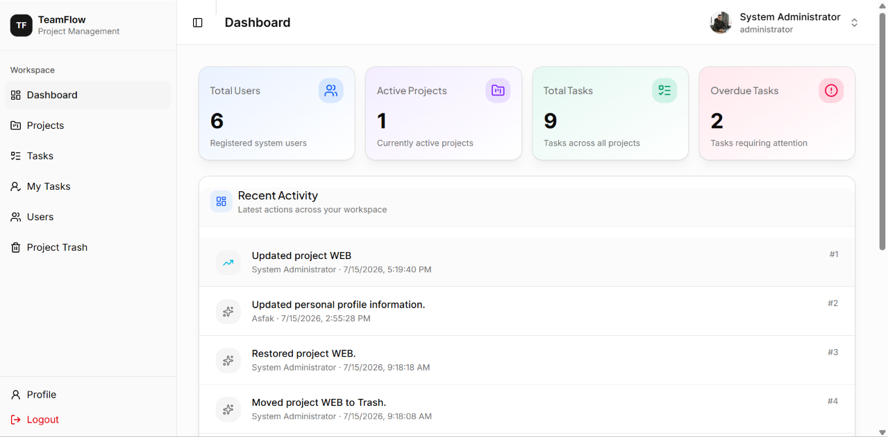
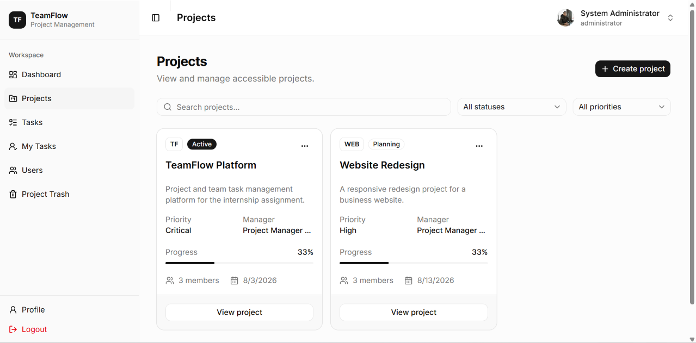
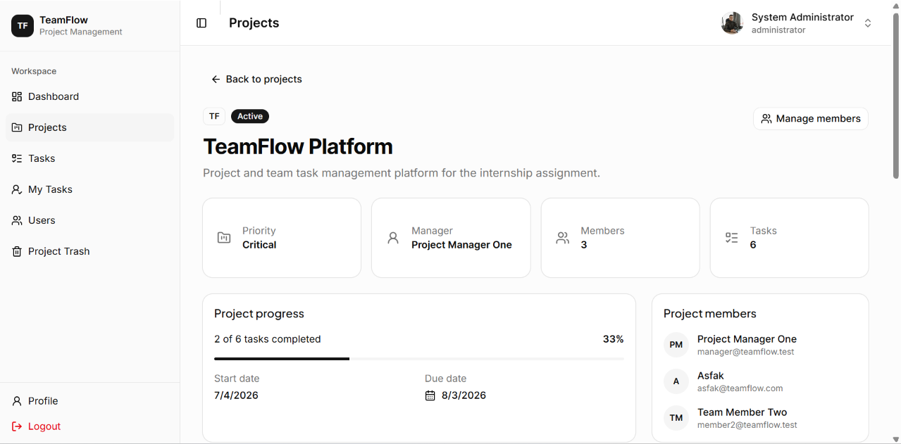
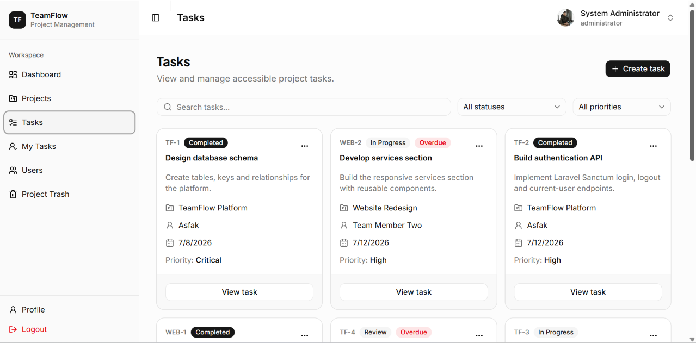
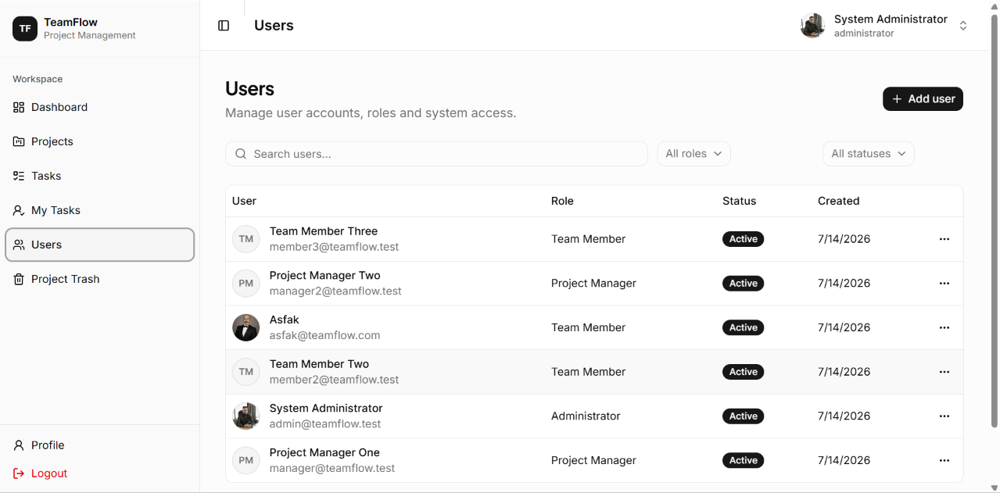
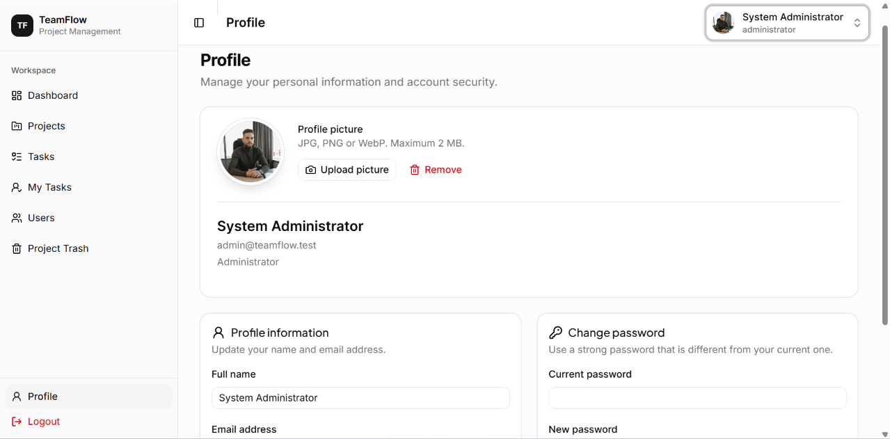

# 🚀 TeamFlow

A modern **Project and Team Task Management Platform** built with **Next.js**, **Laravel 13**, and **MySQL**.

---

## 📖 Overview

TeamFlow is a full-stack web application designed to simplify project planning, team collaboration, and task management within organizations.

The platform enables administrators, project managers, and team members to collaborate efficiently through role-based access control, secure authentication, project organization, task assignment, activity tracking, and profile management.

---

# ✨ Features

## 🔐 Authentication

- Secure Login
- Logout
- Laravel Sanctum Authentication
- Session-based Authentication
- CSRF Protection

---

## 📊 Dashboard

- Role-based Dashboard
- Project Statistics
- Task Statistics
- Quick Overview Cards

---

## 👥 User Management

- View Users
- Search Users
- Create User
- Edit User
- Delete User
- Change User Role
- Change User Status

---

## 👤 Profile

- View Profile
- Update Personal Information
- Change Password
- Upload Profile Avatar
- Delete Avatar

---

## 📁 Project Management

- Create Project
- Edit Project
- Delete Project
- Soft Delete
- Restore Deleted Project
- Permanently Delete Project
- View Project Details
- Search Projects
- Filter Projects

---

## 👨‍💼 Project Member Management

- Add Members
- Remove Members
- Prevent Removing Project Manager
- Member Assignment

---

## ✅ Task Management

- Create Task
- Edit Task
- Delete Task
- Assign Task
- Update Task Status
- View Task Details
- Search Tasks
- Filter Tasks

---

## 📝 My Tasks

- View Assigned Tasks
- Search Assigned Tasks
- Filter Assigned Tasks

---

## 🔒 Authorization

- Laravel Policies
- Gates
- Spatie Laravel Permission
- Role Based Access Control

Roles

- Administrator
- Project Manager
- Team Member

---

# 🛠 Technology Stack

## Frontend

- Next.js 15
- React
- TypeScript
- Tailwind CSS
- TanStack Query
- Axios
- Base UI
- shadcn/ui
- Lucide Icons

---

## Backend

- Laravel 13
- PHP 8.3
- Laravel Sanctum
- Spatie Laravel Permission
- Eloquent ORM

---

## Database

- MySQL

---

## Development Tools

- Git
- GitHub
- GitHub Actions
- VS Code
- Postman

---

# 📂 Project Structure

```
PROJECT-TEAM-MANAGER
│
├── frontend
        src
        
         __├── app
           ├── components
           ├── hooks
           ├── lib
           ├── services
           ├── types
           └── public
│
├── backend
│   ├── app
│   ├── database
│   ├── routes
│   ├── storage
│   ├── config
│   └── public
│
└── docs
    ├── diagrams
    ├── postman
        |- TeamFlow API.postman_collection.json
    └── README-assets
```

---

# 🖼 Application Screenshots

## Login

```
docs/README-assets/login.png
```

---

## Dashboard

```
docs/README-assets/dashboard.png
```

---

## Projects

```
docs/README-assets/projects.png
```

---

## Project Details

```
docs/README-assets/project-details.png
```

---

## Tasks

```
docs/README-assets/tasks.png
```

---

## Users

```
docs/README-assets/users.png
```

---

## Profile

```
docs/README-assets/profile.png
```



```markdown

```

---

# 🔑 Demo Credentials

For evaluation purposes, the following accounts can be used.

| Role | Email | Password |
|-------|---------|----------|
| Administrator | admin@teamflow.test | Password123! |
| Project Manager | manager@teamflow.test | Password123! |
| Team Member | member@teamflow.test | Password123! |

---

# ⚙ Backend Setup

## Clone Repository

```bash
git clone https://github.com/asfak-am/project-team-manager.git
```

---

## Backend

```bash
cd backend
```

Install dependencies

```bash
composer install
```

Copy environment file

```bash
cp .env.example .env
```

Generate key

```bash
php artisan key:generate
```

Configure your database inside `.env`

```env
DB_CONNECTION=mysql
DB_HOST=127.0.0.1
DB_PORT=3306
DB_DATABASE=teamflow
DB_USERNAME=root
DB_PASSWORD=
```

Run migrations

```bash
php artisan migrate
```

(Optional)

```bash
php artisan db:seed
```

Create storage link

```bash
php artisan storage:link
```

Run server

```bash
php artisan serve
```

Backend URL

```
http://localhost:8000
```

---

# 💻 Frontend Setup

```bash
cd frontend
```

Install dependencies

```bash
npm install
```

Create

```
.env.local
```

```env
NEXT_PUBLIC_API_URL=http://localhost:8000
```

Run application

```bash
npm run dev
```

Frontend URL

```
http://localhost:3000
```

---

# 📦 Production Build

Backend

```bash
php artisan optimize
```

Frontend

```bash
npm run build
npm start
```

---

# 🔐 Authentication

The application uses

- Laravel Sanctum
- Session Cookies
- CSRF Protection

---

# 🛡 Authorization

Role-based authorization is implemented using

- Spatie Laravel Permission
- Laravel Policies
- Laravel Gates

---

# 🌐 API

The frontend communicates with the backend using REST APIs.

Postman collection is included in here👉 ```  ```

Example endpoints

```
POST /api/login
POST /api/logout

GET /api/user

GET /api/projects
POST /api/projects
PUT /api/projects/{id}
DELETE /api/projects/{id}

GET /api/tasks
POST /api/tasks
PUT /api/tasks/{id}

GET /api/users
POST /api/users
PUT /api/users/{id}
DELETE /api/users/{id}
```

---

# 📑 Documentation

Project documentation is available in the **docs** folder.

- Entity Relationship Diagram
- Use Case Diagram
- System Architecture Diagram
- Feature Completion Report
- CI/CD Workflow Explanation

---

# ⚠ Known Limitations

- No email notifications are currently implemented.
- File uploads are limited to profile avatars.
- Real-time notifications are not available.
- Activity logs are only available for major operations.
- Mobile responsiveness is optimized for modern devices but has not been tested on all screen sizes.

---

# 🔮 Future Improvements

- Email Notifications
- Real-time Notifications using Laravel Reverb/WebSockets
- Calendar Integration
- Task Attachments
- Gantt Chart
- Kanban Board
- Team Chat
- Project Analytics
- Dark Mode Preferences
- Two-Factor Authentication (2FA)
- Audit Log Dashboard

---

# 👨‍💻 Developed By

**A.M Asfak Ahamed**

BSc (Hons) Information Technology  
Specialization in Software Engineering

SLIIT

---

# 📄 License

This project was developed as part of the **Intern Full Stack Developer Assessment** and is intended for educational and evaluation purposes.