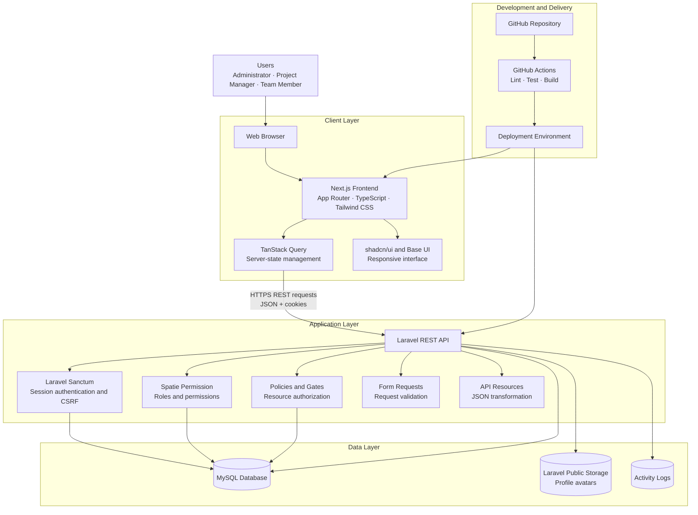

# TeamFlow Basic System Architecture

```mermaid
flowchart TB
    USER["Users<br/>Administrator · Project Manager · Team Member"]

    subgraph CLIENT["Client Layer"]
        BROWSER["Web Browser"]
        NEXT["Next.js Frontend<br/>App Router · TypeScript · Tailwind CSS"]
        QUERY["TanStack Query<br/>Server-state management"]
        UI["shadcn/ui and Base UI<br/>Responsive interface"]
    end

    subgraph API["Application Layer"]
        LARAVEL["Laravel REST API"]
        SANCTUM["Laravel Sanctum<br/>Session authentication and CSRF"]
        SPATIE["Spatie Permission<br/>Roles and permissions"]
        POLICY["Policies and Gates<br/>Resource authorization"]
        VALIDATION["Form Requests<br/>Request validation"]
        RESOURCE["API Resources<br/>JSON transformation"]
    end

    subgraph DATA["Data Layer"]
        MYSQL[("MySQL Database")]
        STORAGE[("Laravel Public Storage<br/>Profile avatars")]
        LOGS[("Activity Logs")]
    end

    subgraph DEVOPS["Development and Delivery"]
        GITHUB["GitHub Repository"]
        ACTIONS["GitHub Actions<br/>Lint · Test · Build"]
        DEPLOY["Deployment Environment"]
    end

    USER --> BROWSER
    BROWSER --> NEXT

    NEXT --> UI
    NEXT --> QUERY

    QUERY -->|"HTTPS REST requests<br/>JSON + cookies"| LARAVEL

    LARAVEL --> SANCTUM
    LARAVEL --> SPATIE
    LARAVEL --> POLICY
    LARAVEL --> VALIDATION
    LARAVEL --> RESOURCE

    SANCTUM --> MYSQL
    SPATIE --> MYSQL
    POLICY --> MYSQL
    LARAVEL --> MYSQL
    LARAVEL --> STORAGE
    LARAVEL --> LOGS

    GITHUB --> ACTIONS
    ACTIONS --> DEPLOY

    DEPLOY --> NEXT
    DEPLOY --> LARAVEL
```