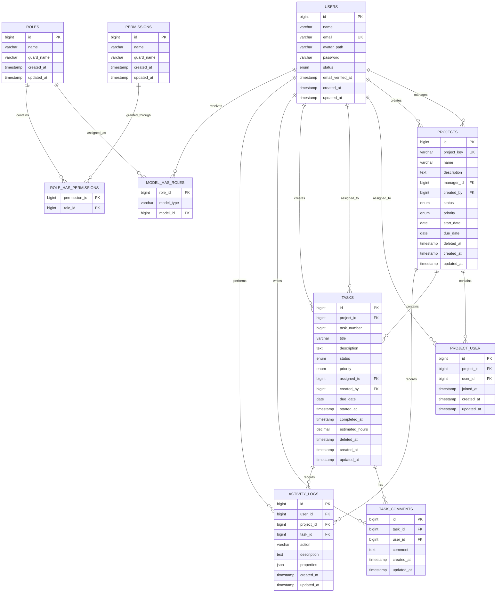

# TeamFlow Entity Relationship Diagram

```mermaid
erDiagram
    USERS {
        bigint id PK
        varchar name
        varchar email UK
        varchar avatar_path
        varchar password
        enum status
        timestamp email_verified_at
        timestamp created_at
        timestamp updated_at
    }

    PROJECTS {
        bigint id PK
        varchar project_key UK
        varchar name
        text description
        bigint manager_id FK
        bigint created_by FK
        enum status
        enum priority
        date start_date
        date due_date
        timestamp deleted_at
        timestamp created_at
        timestamp updated_at
    }

    PROJECT_USER {
        bigint id PK
        bigint project_id FK
        bigint user_id FK
        timestamp joined_at
        timestamp created_at
        timestamp updated_at
    }

    TASKS {
        bigint id PK
        bigint project_id FK
        bigint task_number
        varchar title
        text description
        enum status
        enum priority
        bigint assigned_to FK
        bigint created_by FK
        date due_date
        timestamp started_at
        timestamp completed_at
        decimal estimated_hours
        timestamp deleted_at
        timestamp created_at
        timestamp updated_at
    }

    TASK_COMMENTS {
        bigint id PK
        bigint task_id FK
        bigint user_id FK
        text comment
        timestamp created_at
        timestamp updated_at
    }

    ACTIVITY_LOGS {
        bigint id PK
        bigint user_id FK
        bigint project_id FK
        bigint task_id FK
        varchar action
        text description
        json properties
        timestamp created_at
        timestamp updated_at
    }

    ROLES {
        bigint id PK
        varchar name
        varchar guard_name
        timestamp created_at
        timestamp updated_at
    }

    PERMISSIONS {
        bigint id PK
        varchar name
        varchar guard_name
        timestamp created_at
        timestamp updated_at
    }

    MODEL_HAS_ROLES {
        bigint role_id FK
        varchar model_type
        bigint model_id FK
    }

    ROLE_HAS_PERMISSIONS {
        bigint permission_id FK
        bigint role_id FK
    }

    USERS ||--o{ PROJECTS : manages
    USERS ||--o{ PROJECTS : creates

    USERS ||--o{ PROJECT_USER : assigned_to
    PROJECTS ||--o{ PROJECT_USER : contains

    PROJECTS ||--o{ TASKS : contains
    USERS ||--o{ TASKS : assigned_to
    USERS ||--o{ TASKS : creates

    TASKS ||--o{ TASK_COMMENTS : has
    USERS ||--o{ TASK_COMMENTS : writes

    USERS ||--o{ ACTIVITY_LOGS : performs
    PROJECTS ||--o{ ACTIVITY_LOGS : records
    TASKS ||--o{ ACTIVITY_LOGS : records

    USERS ||--o{ MODEL_HAS_ROLES : receives
    ROLES ||--o{ MODEL_HAS_ROLES : assigned_as

    ROLES ||--o{ ROLE_HAS_PERMISSIONS : contains
    PERMISSIONS ||--o{ ROLE_HAS_PERMISSIONS : granted_through
```