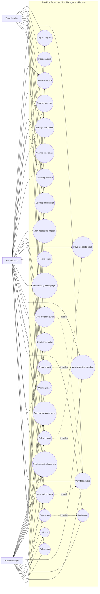

# TeamFlow Use Case Diagram

```mermaid
flowchart LR
    ADMIN["Administrator"]
    MANAGER["Project Manager"]
    MEMBER["Team Member"]

    subgraph SYSTEM["TeamFlow Project and Task Management Platform"]
        AUTH(("Log in / Log out"))
        DASHBOARD(("View dashboard"))
        PROFILE(("Manage own profile"))
        PASSWORD(("Change password"))
        AVATAR(("Upload profile avatar"))

        USERS(("Manage users"))
        ROLE(("Change user role"))
        STATUS(("Change user status"))

        VIEW_PROJECTS(("View accessible projects"))
        CREATE_PROJECT(("Create project"))
        UPDATE_PROJECT(("Update project"))
        DELETE_PROJECT(("Delete project"))
        TRASH_PROJECT(("Move project to Trash"))
        RESTORE_PROJECT(("Restore project"))
        FORCE_DELETE_PROJECT(("Permanently delete project"))

        MEMBERS(("Manage project members"))

        VIEW_ALL_TASKS(("View project tasks"))
        VIEW_MY_TASKS(("View assigned tasks"))
        CREATE_TASK(("Create task"))
        UPDATE_TASK(("Edit task"))
        ASSIGN_TASK(("Assign task"))
        UPDATE_TASK_STATUS(("Update task status"))
        DELETE_TASK(("Delete task"))

        VIEW_TASK(("View task details"))
        COMMENTS(("Add and view comments"))
        DELETE_COMMENT(("Delete permitted comment"))
    end

    ADMIN --> AUTH
    ADMIN --> DASHBOARD
    ADMIN --> PROFILE
    ADMIN --> PASSWORD
    ADMIN --> AVATAR
    ADMIN --> USERS
    ADMIN --> ROLE
    ADMIN --> STATUS
    ADMIN --> VIEW_PROJECTS
    ADMIN --> CREATE_PROJECT
    ADMIN --> UPDATE_PROJECT
    ADMIN --> DELETE_PROJECT
    ADMIN --> TRASH_PROJECT
    ADMIN --> RESTORE_PROJECT
    ADMIN --> FORCE_DELETE_PROJECT
    ADMIN --> MEMBERS
    ADMIN --> VIEW_ALL_TASKS
    ADMIN --> VIEW_MY_TASKS
    ADMIN --> CREATE_TASK
    ADMIN --> UPDATE_TASK
    ADMIN --> ASSIGN_TASK
    ADMIN --> UPDATE_TASK_STATUS
    ADMIN --> DELETE_TASK
    ADMIN --> VIEW_TASK
    ADMIN --> COMMENTS
    ADMIN --> DELETE_COMMENT

    MANAGER --> AUTH
    MANAGER --> DASHBOARD
    MANAGER --> PROFILE
    MANAGER --> PASSWORD
    MANAGER --> AVATAR
    MANAGER --> VIEW_PROJECTS
    MANAGER --> CREATE_PROJECT
    MANAGER --> UPDATE_PROJECT
    MANAGER --> DELETE_PROJECT
    MANAGER --> MEMBERS
    MANAGER --> VIEW_ALL_TASKS
    MANAGER --> VIEW_MY_TASKS
    MANAGER --> CREATE_TASK
    MANAGER --> UPDATE_TASK
    MANAGER --> ASSIGN_TASK
    MANAGER --> UPDATE_TASK_STATUS
    MANAGER --> DELETE_TASK
    MANAGER --> VIEW_TASK
    MANAGER --> COMMENTS
    MANAGER --> DELETE_COMMENT

    MEMBER --> AUTH
    MEMBER --> DASHBOARD
    MEMBER --> PROFILE
    MEMBER --> PASSWORD
    MEMBER --> AVATAR
    MEMBER --> VIEW_PROJECTS
    MEMBER --> VIEW_MY_TASKS
    MEMBER --> UPDATE_TASK_STATUS
    MEMBER --> VIEW_TASK
    MEMBER --> COMMENTS
    MEMBER --> DELETE_COMMENT

    CREATE_PROJECT -. includes .-> MEMBERS
    CREATE_TASK -. includes .-> ASSIGN_TASK
    VIEW_MY_TASKS -. extends .-> VIEW_TASK
    VIEW_ALL_TASKS -. extends .-> VIEW_TASK
    DELETE_PROJECT -. includes .-> TRASH_PROJECT
```